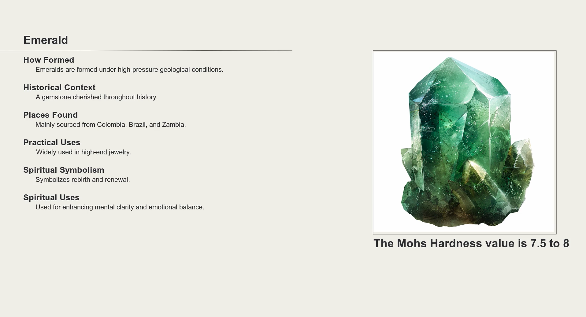

# Video Generator #

This video generator creates a template based format to generate videos appropriate for sites like YouTube. It does this by:
1. Defining the type of topic
1. Using an LLM to generate a JSON file describing details and video instructions about a subject of that topic
1. Using ElevenLabs to create the audio voice over in the videos
1. Using an LLM to generate a video description
1. Using these elements to create a video

You will need the following files for this to work:

| File                      | Description                                                                                                                                                     |
|---------------------------|-----------------------------------------------------------------------------------------------------------------------------------------------------------------|
| `src/config.json`         | The config file that defines the subject matter of the videos.                                                                                                  |
| `src/assets/outro.mp4`    | This is the video that gets appended to every video. This can include a logo, subscribe like stuff, etc                                                         |
| `src/assets/template.png` | The template from which to generate the video. The background.                                                                                                  |
| `.env`                    | Environment variables to define API keys to ChatGPT and ElevenLabs                                                                                              |
| `ffmpg`                   | Installed video file generator - see https://www.ffmpeg.org/ for more information                                                                               |
| `img.png`                 | The image of the subject. This can be generated using the included DallE prompt or created and saved to the `src/assets/subject_name/img.png` file per subject. | 

### Config File `(src/config.json)`
This code generates a video on any range of subjects. For this example, it's creating videos on crystals/gems. 
The subject-matter is defined in config.json. Here is an example:

```json
{
  "subjects": [
    "Emerald",
    "Blue Moonstone",
    "Prasiolite"
  ],
  "voice_id": "ThT5KcBeYPX3keUQqHPh",
  "image_subtitle": "Figure: ",
  "agent_instruction": "You are an expert at geology of different types of gems and minerals",
  "script_prompt": "As an expert at geology, {topic} ...",
  "generic_image_prompt": " - The image should only show the rock or gem on a white background."
}
```

| Field                  | Description                                                                                                                                                                                                                                                                                                              |
|------------------------|--------------------------------------------------------------------------------------------------------------------------------------------------------------------------------------------------------------------------------------------------------------------------------------------------------------------------|
| `subjects[]`           | A list of subject topics to generate a video for                                                                                                                                                                                                                                                                         |
| `voice_id`             | The ElevenLabs voice ID to use for the video. You can find the ID of a voice. You can find this ID at https://elevenlabs.io/app/voice-lab, find voice you like, on the right side, click 'View' and at the bottom of the details will be a away to copy the ID. You can also use the API to find all the voices and IDs. |
| `image_subtitle`       | Any generic text that you want to go under the image before the actual content                                                                                                                                                                                                                                           |
| `agent_instruction`    | The description of role of the agent generating the video content                                                                                                                                                                                                                                                        | 
| `script_prompt`        | The actual prompt to ask the LLM to generate a `src/assets/subject_name/script.json` in a consistent way to generate the video content.                                                                                                                                                                                  | 
| `generic_image_prompt` | Instructions to append to every AI image prompt. This will allow you to create a consistent style, across the AI generated prompts.                                                                                                                                                                                      | 


### Outro Video `(src/assets/outro.mp4)` 

Generally, you want to follow up the generated video with branded content. This you can create using any video generator (such as CapCut) and place it in the
`src/assets` directory. The script will append it.

### Video Background `(src/assets/template.png)` ### 

  

This template contains a divider between the title and the content and a place to put an image. The video generator expects the template spacing.

### Environment variables file `(.env)` ###

To make this code work, you will need to create a .env file in your home directory with the following environment variables:

```json
ELEVENLABS_API_KEY=xxx
OPENAI_API_KEY=yyy
```

This allows you to perform a search from OpenAI and generate audio from ElevenLabs. For instructions on how to get an API key for each, go here (subject to change, I assume):

https://platform.openai.com/settings/organization/api-keys  
https://elevenlabs.io/app/settings/api-keys

You will have to have paid accounts for both.

### Image Files

As many of you certainly realize, creating images that look good are often a hard thing to do, at least with any consistency
and what's more, I have a hard time finding a decent AI image generator with a decent API. I ended up using MidJourney and
just putting in the prompt in manually. It does make it a little bit easier by having the LLM generate an AI prompt, but
it often takes a few generations to find something useful. Because of this, the script will know if an image exists in the
`src/assets/subject_name` directory. It will look for an image that is named `img.png`. Once you find a good
image (square aspect ratio), just put it in that directory. If you don't it will tell you to find one and even give you the AI prompt
if you need it, but not continue on with the video generation until the image exists in the directory. An example response looks like this:
```json
Black Tourmanile: You now have to get an image of Black Tourmanile before you can continue - called assets/black_tourmanile/img.png. The prompt should be: 
    A high-resolution image of a raw and polished Black Tourmaline crystal, showcasing its deep black color and intricate surface textures, with natural lighting to highlight its unique features. - The image should only show the rock or gem on a white background.

```

### Script File ##
One of the first thing the video generator does is generate a script file `(src/assets/script_name/script.json)`. This script
describes the contents of the video for the specific subject. The prompt to generate the script is located in the `config.json` 
file should create a file for the subject in the following format:


| field name              | purpose                                                                                                                                                                                                                                                                                                                                                                                |
|-------------------------|----------------------------------------------------------------------------------------------------------------------------------------------------------------------------------------------------------------------------------------------------------------------------------------------------------------------------------------------------------------------------------------|
| `title`                 | subject value                                                                                                                                                                                                                                                                                                                                                                          |
| `description_narration` | The narration that will introduce the video                                                                                                                                                                                                                                                                                                                                            |
| `ai_image_prompt`       | Text to feed the image generator                                                                                                                                                                                                                                                                                                                                                       |
| `text_below_image`      | If you want to subtitle under the image, ask the LLM to generate a relevant one                                                                                                                                                                                                                                                                                                        |
| `details[]`             | A list of content details. This is completely configurable. Each detail has three components, `type`, `text_value`, `narration_value`. It will take the type and use that as a title. For example, `how_formed` becomes 'How Formed' so be careful what you name this. `text_value` is the text that is shown on the video screen and the `narration_value` is the voice over content. |

Sometimes, even when you explicitly say how you want the JSON file to be formated (see the prompt below), the LLM doesn't always 
listen so make sure you double-check the generated file, just in case. Here's an example file (shorted for the sake of brevity) :

```json
{
  "title": "Emerald",
  "description_narration": "Dive into the dazzling world of emeralds, a gemstone revered for its brilliant green color...",
  "ai_image_prompt": "Create an image of a radiant emerald gemstone, displaying its vibrant green hue, intricate ...",
  "text_below_image": "The Mohs Hardness value is 7.5 to 8",
  "details": [
    {
      "type": "how_formed",
      "text_value": "Emeralds are formed under high-pressure geological conditions.",
      "narration_value": "Emeralds are formed deep within the Earth's crust..."
    },
    {
      "type": "historical_context",
      "text_value": "A gemstone cherished throughout history.",
      "narration_value": "Emeralds have been cherished since antiquity..."
    },
    {
      "type": "places_found",
      "text_value": "Mainly sourced from Colombia, Brazil, and Zambia.",
      "narration_value": "Emeralds are typically extracted from countries known "
    }
  ]
}
```

The prompt to the LLM may look like this to generate the `assets/subject_name/script.json` file (in the `src/config.json` file). The 
code will replace any `{topic}` tag with the subject name before it is sent to the LLM:

```
As an expert at geology and the properties of different types of gems and minerals, I want a thorough description of '{topic}'.   

I want a JSON file that will be turned into visuals and a script for a YouTube video describing this rock. It should include:  
How the rock is created,  Where on earth it is found,  The Mohs Hardness scale of the rock,  Prompt to generate an AI image of the rock   

The JSON file format should be:  

  title: '{topic}',  
  description_narration: '',
  ai_image_prompt: '',  
  text_below_image: 'Mohs Hardness value',  
  details: [
    type: 'how_formed', text_value='', narration_value='',
    type: 'historical_context', text_value='', narration_value='',
    type: 'places_found', text_value='', narration_value=''
  ]
    
text_value should indicate a short description of rock that will be converted to text in the video screen while the narration_value 
will be a longer description used as a voice over the content. The response should only include the JSON content."
```

When the script is parsed, it will translate the content of the script into the video. The title will go above the line in the
template, the image in the subject directory will go in the image box in the template (resized to fit it) with the AI prompt available
to help in image generation and the text below the image will have the Mohr hardness value of the stone.

For the details, the video will generate text that looks like this:  

```
How Formed:
    Emeralds are formed under high-pressure geological conditions.
```

The `narration_value` will be the generated text to speech that will be spoken as the text appears on the video.

### Script Logic

To execute the script:
```shell
$ cd src
$ python subject_video_generator.py
```
When you run `subject_video_generation.py`, it will follow the following steps:
- Retrieve the subjects from the `src/config.json` file
- Iterate over those subjects:
   - Verify that the subject directory `src/assets/subject_name` exists. For example, 'Blue Moonstone' becomes the directory `src/assets/blue_moonstone`
   - Verify that the subject audio directory exist `src/assets/subject_name/audio`
   - Verify that the `src/assets/subject_name/script.json` exists. If it doesn't:
     - Generate the file using the prompt in `src/config.json` and place the `script.json` into the `src/assets/subject_name` directory.
   - Verify that the audio files exist. If they don't, generate all the audio files from ElevenLabs and place them in the `src/assets/subject_name/audio` directory from the narration values in the `src/assets/subject_name/script.json` file.
   - Verify that there is an image called `src/assets/subject_name/img.png`. If it isn't:
     - Display the AI prompt to create the image and discontinue the video generation for this subject
   - Verify that there is a description file `src/assets/subject_name/description.txt`. This can be used as a value in the description field of the YouTube video. It is generated using the LLM based on the narration of the video from the `src/assets/subject_name/script.json` file
   - Verify that there is a video file called `src/assets/subject_name/main_video.mp4`. If there isn't:
     - Construct the video using the `src/assets/subject_name/script.json` file for the video text, the audio files in `src/assets/subject_name/audio` for the voiceover, the image file `src/assets/subject_name/img.png`, the background template `src/assets/template.png` and the outro video `src/assets/outro.mp4`

The advantage of the script is that it will only generate content if it doesn't already exist. If you want to regenerate the video, but you like everything else, just delete `src/assets/subject_name/main_video.mp4` and redo the script. If all assets are in place, it will just skip it so there is no cost for rerunning the script.

## Example

A full example is in `src/assets/emerald`. It contains:

- [src/assets/emerald/script.json](src/assets/emerald/script.json) - the generated video instruction file
- [src/assets/emerald/img.png](src/assets/emerald/img.png) - The image of the subject
- [src/assets/emerald/audio/detail_0.mp3](src/assets/emerald/audio/detail_0.mp3) - generated detail narration
- [src/assets/emerald/audio/detail_1.mp3](src/assets/emerald/audio/detail_1.mp3) - generated detail narration
- [src/assets/emerald/audio/detail_2.mp3](src/assets/emerald/audio/detail_2.mp3) - generated detail narration
- [src/assets/emerald/audio/detail_3.mp3](src/assets/emerald/audio/detail_3.mp3) - generated detail narration
- [src/assets/emerald/audio/detail_4.mp3](src/assets/emerald/audio/detail_4.mp3) - generated detail narration
- [src/assets/emerald/audio/detail_5.mp3](src/assets/emerald/audio/detail_5.mp3) - generated detail narration
- [src/assets/emerald/audio/intro.mp3](src/assets/emerald/audio/intro.mp3) - The generated introduction narration
- [src/assets/emerald/main_video.mp4](src/assets/emerald/main_video.mp4) - The final video
- [src/assets/emerald/description.txt](src/assets/emerald/description.txt) - The generated video description

The generated video file [main_video.mp4](src/assets/emerald/main_video.mp4), will look something like this:

  

### Finally ...

This is really just an example and frankly, not that creative an UI design (I'm a back end developer at heart) but it shows
you how to:

- Use AI to generate content for a video
- Create prompts to generate consistent JSON
- Use AI to generate text to speech for that content
- Put together a video using that generated content

Most importantly, it shows how to combine AI content generation with coding that often requires more predictable formatting. 

**(warning)** I used the new OpenAI swarm code for some of this, and it may not be available in the future, but you can use
the standard ChatGPT chat interface as well as plug in other LLMs fairly easily.